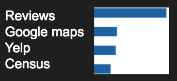

# Predicting Restaurant Closure
## Will It Close? - [www.WillitClose.com](http://www.willitclose.com)
## [Watch the presentation on Youtube](https://www.youtube.com/watch?v=te4h5v2pU8M)

## About this project
I ***love*** Mongolian grill. So I was heartbroken to find out that my favorite Mongolian grill restaurant had closed. But from this tragedy I found an opportunity. I thought that if I could accurately predict restaurant closure, that would provide valuable information to stakeholders, such as investors, that need a risk assessment of a restaurant. The closing probability predictions were made on restaurant data from May 2018 and deployed at [www.willitclose.com](www.willitclose.com)

## Overview
- Data sources:
	- Yelp academic dataset
	- Google Maps API
	- Data scraped from US Census website
- Data capture
	- Selenium
	- Requests
- Data storage:
	- MongoDB
- Data manipulation:
	- Pandas
	- TFIDF
- Modeling - all done with Sklearn
	- Train test split (validation)
	- RandomForestClassifier, AdaBoostClassifier, GradientBoostingClassifier, KNeighborsClassifier, DecisionTreeClassifier, LogisticRegression
	- Pickle (saving model)
	- ROC curve, AUC, classification report
- Exploratory Data Analysis
	- Matplotlib

*Continue reading if you are curious about the details of the project, otherwise feel free to check out the code, the website, or email me at <ellcrane@gmail.com>*

## Data Sources

### Starting point

My starting point for this project was a Yelp Academic Dataset from January 2018 on ~175,000 businesses in different industries around the world. After slicing this data down to only those businesses I was interested in, restaurants in the US that were still in business, I had ~35,000 businesses. The restaurants were in 6 major cities, but the final model would be able to make predictions on restaurants in any location.

I then used the Google Maps API to get the updated information on if the restaurants were still open or closed. About 2% or 700 restaurants had closed in that 4 month period from January 2018 to May 2018.

### Yelp Academic Dataset - Basic Information
This included review count, star rating, price level, category (Chinese, Sandwiches, etc.), attributes (has wifi, noise level, bike parking, etc.). The categorical and attributes data had to be cleaned and procured from the columns using pandas apply/lambda.
### Yelp Academic Dataset - Reviews
In order to get more granular features, I bucketed the reviews into 1-star, 2-4 star, and 5-star and then did TFIDF, so the features looked like [# of stars]: [word] (5-star: “service”, etc.). In order to limit the total number of features, I only used the most frequent 100 words from each star bucket for open restaurants, then did the same for closed restaurants. This resulted in a total of 322 features. To limit this feature count further, I put exclusively these features into a gradient boosted classifier to predict if the restaurant were open/closed, and then used only the top 100 features by feature importance in the final model.
United States Census Bureau
I thought that economic data about the location in which the restaurant was located would be important, so I went to the census website. Their data was very poorly documented and difficult to parse, so I decided I would scrape the data, which was organized by zip code on factfinder.census.gov. Some of the information I collected was average income, average age, percentage living in poverty, and the number of veterans.
### Google Maps API
I also thought that information on a restaurant’s competitiveness, such as the density in that area, or the average price/star-rating of its neighbors would be relevant. I used the Google Maps Places API to get that data, and also engineered features such as restaurant rating minus the average rating of nearby restaurants. 

## Modeling
For modeling, I used Random Forest, Gradient Boost, KNeighbors, and Logistic Regression. With a .66/.33 train/test split, gradient boost performed the best, with an AUC of .73.

For the predictions on the website, only the Yelp - Basic Information features were used, as those were the easiest to obtain for new data, as it could be obtained only by using the Google Maps and Yelp API. The AUC only using this basic information was .67.

Based on these AUCs, predicting restaurant closure in 4 months is still very difficult to do, but the model does provide some signal.

## Feature Overview
The final model had the following feature count by category:
- Reviews: 100
- Google Maps: 6
- Yelp: 100
- Census: 18

Here’s a breakdown of feature importance, or how often the model used each feature:

<!--  -->

As you can see, the review-based features were used most often, which isn’t surprising since review-based features were tied for the most number of features. It is interesting that the Google Maps restaurant competitiveness based features were used second most, even though there were only 6 of those features. I think this suggests that those features were very important, and additional features that compare a restaurant to its surroundings would be useful.

## Potential Improvements
- More features
	- I think the biggest improvement in this project would come from improving the predictive power of the model.
- Improve website
	- I would like to add functionality so that a user can enter in any US restaurant on Yelp and could get a probability for that restaurant. Currently www.willitclose.com has a static database of 35,000 restaurants in the US.
	- I would like to engineer the predictions so that the predictions on current restaurants use all the features from the train/test split, since the AUC using all features is higher than when just using the Yelp Basic Information
- More business categories
	- Businesses such as retail and services that provide a lot of relevant data on their Yelp and Google Maps pages likely could also get predictions

## Me - please contact with any questions or comments!
Elliott Crane

Data Scientist

[www.willitclose.com](http://www.willitclose.com)

<ellcrane@gmail.com>

[linkedin.com/in/ellcrane](https://www.linkedin.com/in/ellcrane/)

[github.com/ellcrane](https://github.com/ellcrane)
